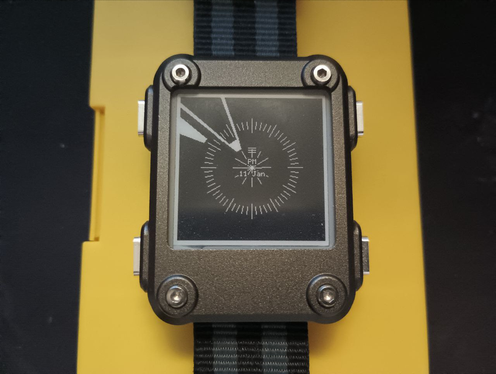

# watchy_peony

Tested with Watchy 1.4.10

... or you could just look up a standard settings.h on this one.

Hour hand is the longer hand, extending to the inner star.

Minute hand is the shorter hand, extending to the outer circle.

Battery charge is indicated by notches on 12 mark. No notches? Past time to charge. Never any notches? Confirm you selected the correct watchy version.

Font used is https://github.com/robjen/GFX_fonts/blob/master/GFX_fonts/Font5x7FixedMono.h